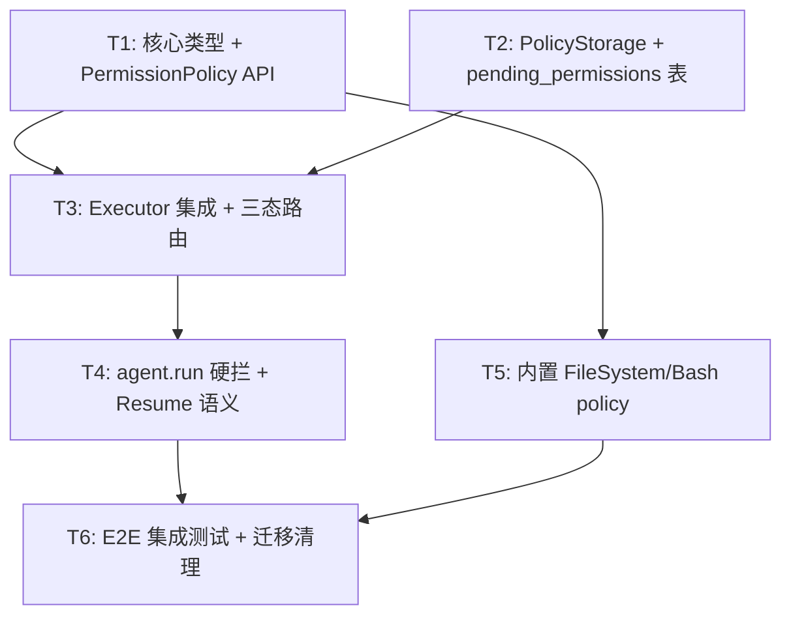

# RFC-0019: 工具权限管理（PermissionPolicy 框架原语）

## 摘要

在 NexAU 中引入 **Tool Permission Management** 能力，作为框架层的一等公民。核心抽象：

- **`PermissionPolicy`**：可插拔的"工具准入决策函数"，签名 `check(tool, ctx, **input_kwargs) -> PermissionDecision`
- **`PermissionDecision` 三态**：`Allow` / `Deny(reason)` / `Ask(prompt, choices)`
- **`AgentConfig.permissions`**：per-tool 字典（`dict[str, PermissionPolicy]`），与 `tools` / `llm_config` 并列；每种工具有自己的 policy
- **`Ask` 是纯持久化状态机**——不依赖任何 in-memory 等待句柄（Future / asyncio.Event / callback）；tool 进程不启动、不空耗资源；会话关闭后重开可恢复未决状态
- 框架内置 `FileSystemPermissionPolicy`、`BashPermissionPolicy`；开发者可自定义任意 policy

此 RFC **取代**之前基于 `Middleware.should_stop_agent_run` 的方向（feat/middleware-stop-agent-run 分支 / PR #480），该方向因"在用户插件层暴露框架原语"的分层错位被否决，详见 §3「备选方案」。

## 动机

### 需求场景

当 LLM 驱动的 agent 被允许调用 filesystem / shell / 第三方 API 时，它可能产生不可逆副作用：写坏文件、执行危险命令、消耗付费 API 配额、触发生产环境变更。真实产品（如 Claude Code）必须支持以下交互模式：

- **自动放行**：读操作、命令白名单
- **事前确认（ask）**：写操作、未知命令、高风险 API
- **直接禁止**：`rm -rf` 等危险命令、生产 Stripe key 等
- **策略因工具、参数、session 状态、用户偏好而异**

目前 NexAU 的 `AgentConfig` 里没有任何跟"准入"相关的抽象。这使得嵌入 NexAU 的产品（如 North Coder）必须在业务层自己搭一套权限系统，重复造轮子且无法复用框架侧的 tool metadata。

### 为什么不能用 Middleware 做

我们最初尝试通过 `Middleware.should_stop_agent_run(hook_input) -> str | None` 在中间件层实现（参见 PR #480、`feat/middleware-stop-agent-run` 分支），实践中踩到三条不可调和的问题：

**1. 抽象层错位**。Middleware 是开发者的扩展点，其数据类型（`BeforeToolHookInput` 等）不是框架原语。但"停掉 run"这件事要求框架新增 `STOPPED_BY_MIDDLEWARE` `StopReason`、让 `agent.run()` 的返回值形态改变（`str | tuple[str, dict]`）——框架开始理解并依赖 middleware 返回值的语义。等于把一个 plugin return value 偷偷升格为 framework primitive。

**2. 只能 stop，不能 ask**。Middleware 返回字符串只能表达"停掉本次 run"。CC 的 `allow / deny / ask` 交互模型需要真正的挂起 + 恢复原语，middleware 做不到。硬做的结果是"每次 ask 都要起新的 `agent.run()`"，对话历史里会堆积 orphan tool_use，LLM 出现幻觉（实际踩过，参见 `feat/middleware-stop-agent-run` 分支的 E2E 复盘）。

**3. 不能 per-tool 绑定策略**。Middleware 是全局的，要在 `__call__` 里自己做 tool_name 分派。同一个 tool 在不同 agent 下挂不同策略、或同一个 agent 的多个策略链式组合，middleware 模型都难以自然表达。

### 分层原则

Permission 是一等公民，应和 `tools=[...]`、`system_prompt`、`llm_config` 并列，挂在 `AgentConfig.permissions` 上。它是**工具准入策略**——跟"工具实现"（由 Tool 作者决定）和"工具观测"（由 Middleware 负责）是三件独立的事。

| 职责 | 抽象 | 回答的问题 |
|------|------|-----------|
| 工具实现 | `Tool` | 怎么执行 |
| 工具准入 | `PermissionPolicy`（本 RFC） | 能不能执行 / 要不要问人 |
| 工具观测 | `Middleware` | 执行前后做些切面工作（日志、指标、history 改写） |

## 设计

### 核心类型

#### PermissionPolicy

```
class PermissionPolicy(Protocol):
    def check(
        self,
        tool: Tool,
        ctx: PolicyContext,
        **input_kwargs: Any,
    ) -> PermissionDecision: ...
```

- `check(tool, ctx, **input_kwargs)`：决策函数。`tool` 是被调用的工具对象，`input_kwargs` 是 LLM 本次 tool call 的参数（与 tool schema 对应）。返回三态之一。
- `ctx: PolicyContext`：见下。
- 不需要 `applies_to` 方法——policy 与 tool 的绑定关系在 `AgentConfig.permissions` 字典中**显式声明**（见下），不由 policy 自行声称。

带状态的 policy（如"session 内已被用户 allow 的调用参数记忆"）自行管理状态并**自行负责持久化**（框架提供持久化 helper，见 §3.6）。Ask 被用户 resolve 为 `allow_session` 时，框架会回调 `policy.on_resolve(ctx, decision, metadata)`（可选 hook），policy 可据此更新自己的内部状态（如 session 白名单），使后续同参数调用直接返回 Allow。

#### PermissionDecision

```
@dataclass(frozen=True)
class Allow:
    """允许工具直接派发。"""

@dataclass(frozen=True)
class Deny:
    reason: str | None = None       # 给 LLM 看的拒绝原因（写进 ToolResult），None 时框架用默认文案
    user_reason: str | None = None  # 给用户看的（可选，UI 展示）

@dataclass(frozen=True)
class Ask:
    prompt: str                                  # 给用户看的问题描述
    suggested_choices: list[AskChoice] = field(...)  # 建议的选项按钮

@dataclass(frozen=True)
class AskChoice:
    label: str       # UI 按钮文字: "Allow once" / "Allow for session" / ...
    kind: Literal["allow_once", "allow_session", "deny"]
    metadata: dict = field(default_factory=dict)  # policy 自定义 payload

PermissionDecision = Allow | Deny | Ask
```

**注意**：`PermissionDecision` **不支持改写 tool args**。如果开发者想"允许但限定范围"（例如允许 `read_file` 但只读 `/workspace/**`），应在 policy 判断前 deny，让 LLM 重新生成参数；或用 middleware 改参数后再让 policy pass。职责分层：policy 只做**是/否/问人**，不做参数改写。

#### AgentConfig.permissions

```
AgentConfig(
    ...,
    permissions: dict[str, PermissionPolicy] | None = None,
    # key = tool_name, value = 该工具的 PermissionPolicy
)
```

- 可选字段，`None` 等价空字典，即"全部 tool 默认 Allow"（保持向后兼容，现有 agent 不受影响）。
- **每种工具对应一个 policy**：key 是 `tool.name`，value 是该工具的决策函数。没有出现在字典中的 tool → 默认 Allow。
- 不存在"多个 policy 对同一个 tool 发表意见"的情况——一个 tool 只有一个 policy，决策路径清晰无歧义。

示例：

```
AgentConfig(
    name="code_agent",
    tools=[read_file_tool, write_file_tool, bash_tool],
    permissions={
        "read_file": FileSystemPermissionPolicy(
            readonly_allowed_paths=["/workspace"],
        ),
        "write_file": FileSystemPermissionPolicy(
            ask_on_write=True,
            forbidden_paths=[".env", "~/.ssh/**"],
        ),
        "run_shell_command": BashPermissionPolicy(
            safe={"ls", "cat", "grep", "pwd"},
            forbidden={"rm", "dd", "mkfs"},
        ),
    },
)
```

**注意**：同一个 `PermissionPolicy` 类可以用不同配置实例化后分别绑定不同 tool（如上例中 `read_file` 和 `write_file` 都用 `FileSystemPermissionPolicy`，但配置不同）。这既是 per-tool 绑定，又复用了 policy 实现。

#### PolicyContext

```
@dataclass
class PolicyContext:
    session_id: str
    agent_state: AgentState      # 只读引用, policy 可读 history 等
    tool_call_id: str
    turn_id: str                 # 本 turn 的 batch id (见 §3.4)
    storage: PolicyStorage       # 持久化 helper
```

Policy 需要跨 turn 记忆（如 session 内已允许的命令/路径）时，通过 `ctx.storage` 读写；`PolicyStorage` 封装 SQLite 键值存储，键空间按 `(session_id, policy_instance_id)` 隔离（`policy_instance_id` 默认为 `f"{tool_name}:{policy.__class__.__name__}"`，保证同类 policy 绑不同 tool 时各自独立存储）。

### 执行流程

Executor 在 **tool 派发前**，对每个 tool call 按 `tool_name` 查 `permissions` 字典，找到绑定的 policy（没有则默认 Allow），调用 `policy.check()` 得到决策，根据决策路由：

```
[LLM 返回 tool_calls: T1, T2, T3]
          ↓
  [对每个 Ti: 查 permissions[Ti.tool_name] → policy.check() → decision_i]
          ↓
┌─────────┼────────────────────────┐
│         │                        │
Allow   Deny                     Ask
│         │                        │
立即       立即                   写 pending_permissions 记录,
派发       写 denial                run 结束, 不派发
tool    ToolResult
│         │
└────┬────┘
     ↓
继续 LLM loop
(其他 tool 的结果都在 history 中)
```

### 同 turn 内混合决策策略

一个 turn 内 LLM 可能同时发起 `[T1, T2, T3]`（分别绑定不同的 policy）。各自 policy 判决出 `[Allow, Ask, Deny]` 时：

- **T1（Allow）**：立即派发并写 ToolResult
- **T3（Deny）**：立即写 denial ToolResult（`is_error=True`，content 为 policy 给出的 reason）
- **T2（Ask）**：写 `pending_permissions` 记录（`decision=NULL`）

其它未决（也触发 Ask 的）tool call **独立入库**，每条一条 pending 记录，共享同一个 `turn_id`。

这样的取舍：

- **优点**：简单、低延迟。Allow 类副作用立即发生，符合用户对"已批准工具"的预期；LLM 收到部分结果后可决定是否需要等 Ask 解析；无需复杂状态机管理 "半执行 turn"。
- **缺点**：turn 不是原子的。若用户 deny 了 T2 后又想整个 turn 重来，T1 的副作用（写文件、发邮件等）已回不去。
- **备选方案**：全 turn 冻结，见 §3「备选方案 A2」。

### Ask 的持久化状态机

**核心约束**：
1. Ask 期间 tool 进程**不启动**、executor **不 block**、不留任何 in-memory 等待句柄
2. Session 关闭重开后**可恢复**未决 ask

这两条约束联合作用下，Ask 只能是**纯持久化的状态转换**：

```
[LLM emit tool_call] → [policy → Ask]
       ↓
[executor 写 pending_permissions 记录 (decision=NULL)]
       ↓
[agent.run() 干净返回 status=paused_for_permissions]
       ↓
   ... 人类关窗、重启进程、第二天再登录 ...
       ↓
[UI 从 DB 读 pending, 展示 ask 面板 (一条条 card)]
       ↓
[用户点 allow / deny → UI 写 decision 字段]
       ↓
[所有 pending 的 decision 都非 NULL 时, UI 触发 agent.run() 恢复]
       ↓
[executor 扫 decision: allow → 派发 tool, deny → 写 denial ToolResult]
       ↓
[进入正常 LLM loop]
```

**关键设计点**：
- Ask 不是"异步等待"，是"**结束 run + 可恢复**"
- 所有状态在 DB，没有跨进程 / 跨重启的 in-memory 依赖
- 对话 history 在 ask 发生时已包含 "assistant 消息带 tool_use"；恢复时 executor 补上对应的 tool_result 即可

### Session 状态机与 agent.run() 硬拦

Session 在 permission 维度有三个状态：

```
idle                ← 可以起新 run
  │
  ↓ agent.run() 开始
running             ← 正在跑 LLM loop, UI 输入框 disable
  │
  ↓ 遇到 Ask, 写 pending, run 结束
awaiting_permission ← 有未决 pending, UI 输入框 disable + 展示 ask 面板
  │
  ↓ 所有 pending 都 resolve, UI 触发恢复
running (继续) 或 idle (全部 deny 后 LLM 决定结束)
```

**agent.run() 的硬拦规则**：

```
def run(...):
    pending = self._storage.find_pending_permissions(session_id)
    if pending:
        raise PendingPermissionsError(session_id=session_id, pending=pending)
    # 正常 run loop ...
```

- **前端**：UI 层在 `awaiting_permission` 状态禁用输入框（产品主防线）
- **后端**：`agent.run()` 硬拦作为**纵深防御**，保障脚本直调 API / 非 UI 客户端 / race condition 场景
- **异常类型**：`PendingPermissionsError(pending: list[PendingPermission])`，调用方 catch 后可直接读取列表弹 UI

**备选方案**：软返（`RunResult(status=..., pending=...)` 不抛异常），见 §3「备选方案 A1」。

### 数据库 Schema

#### `pending_permissions` 表

| 字段 | 类型 | 说明 |
|------|------|------|
| `id` | TEXT PK | UUID |
| `session_id` | TEXT FK | `ON DELETE CASCADE` 指向 session 表 |
| `turn_id` | TEXT | 同 turn 的 pending 共享此 id |
| `tool_call_id` | TEXT | LLM 生成的 tool_use id |
| `tool_name` | TEXT | |
| `tool_input` | JSON | LLM 传入的参数 |
| `prompt` | TEXT | policy 生成的 ask 描述 |
| `suggested_choices` | JSON | policy 生成的选项列表 |
| `policy_id` | TEXT | 触发此 ask 的 policy 实例标识（`tool_name:ClassName`，resolve 时用于回调 `on_resolve`） |
| `decision` | TEXT NULL | `NULL` / `allow` / `deny` |
| `decision_metadata` | JSON NULL | 用户选择的 `AskChoice.metadata`（如 `{"scope": "session"}`） |
| `created_at` | TIMESTAMP | |
| `decided_at` | TIMESTAMP NULL | |

**恢复推进的触发条件**：
```sql
SELECT 1 FROM pending_permissions
WHERE session_id = ? AND decision IS NULL
```
结果为空，即可恢复。

**级联清理**：session 被删除时 `ON DELETE CASCADE` 自动清 pending。不需要 TTL —— 每个 session 最多一组未决 pending（硬拦保证），跨 session 的"僵尸 session"是 session 层的问题，不是 permission 层。

#### `policy_state` 表（带状态 policy 的通用存储）

| 字段 | 类型 | 说明 |
|------|------|------|
| `session_id` | TEXT FK | `ON DELETE CASCADE` |
| `policy_id` | TEXT | 如 `run_shell_command:BashPermissionPolicy` |
| `key` | TEXT | policy 自定义 |
| `value` | JSON | policy 自定义 |
| PK | `(session_id, policy_id, key)` | |

`PolicyStorage` helper 基于这张表提供 `get/set/delete` 接口。policy 实现自行决定如何用。

### Resume 语义

`agent.run()` 被再次调用、且 pending 已全部 resolve 时：

1. executor 读出本 session 最近一批 pending（按 `turn_id` 聚合，最新一个 turn）
2. 按 `tool_call_id` 顺序处理：
   - `decision=allow`：回调 `policy.on_resolve(ctx, "allow", metadata)`（policy 可据此更新 session 白名单等内部状态），然后真正派发 tool（执行 binding、记录 ToolResult、处理 middleware before/after hooks）
   - `decision=deny`：回调 `policy.on_resolve(ctx, "deny", metadata)`，然后合成 `ToolResultBlock(is_error=True, content=denial_msg)`，denial_msg 来自 pending 的 `prompt` 或 policy 默认文案（"User declined: {prompt}"）
3. 所有 pending 对应的 tool_result 写入 history
4. 删除已消费的 pending 记录（或标记 `consumed=true`，视保留策略）
5. 进入正常的 LLM loop（用这批 tool_result 继续下一次 LLM 调用）

**幂等性**：resume 过程中进程挂掉时，pending 标记 `decision` 已写、tool 未派发的场景可能重复 resume —— 通过"消费前加 `consumed_at` 标记"确保 allow 类 tool 不会重复执行。

### 内置 Policy

#### FileSystemPermissionPolicy

```
FileSystemPermissionPolicy(
    readonly_allowed_paths: list[str] = ["/workspace"],
    ask_on_write: bool = True,
    forbidden_paths: list[str] = [".env", "~/.ssh/**"],
)
```

- 绑定方式：在 `AgentConfig.permissions` 中按 tool_name 绑定（如 `"read_file"` / `"write_file"` / `"edit_file"`），同一个 policy 类可用不同配置实例化后分绑不同 tool
- 路径匹配使用 `pathspec` 库（gitignore 语义，与 CC 一致）
- 读 tool 绑定的实例：路径在 `readonly_allowed_paths` 下 → Allow；在 `forbidden_paths` → Deny；其它 → Ask
- 写 tool 绑定的实例：`ask_on_write=True` 时，任何非 forbidden 路径 → Ask；forbidden → Deny
- `on_resolve` hook：用户点 "allow_session" 时，将该路径 pattern 加入 `PolicyStorage` 的 session 白名单，后续同路径调用直接 Allow

#### BashPermissionPolicy

```
BashPermissionPolicy(
    safe_commands: set[str] = {"ls", "cat", "grep", "pwd", "echo"},
    forbidden_commands: set[str] = {"rm", "dd", "mkfs", "shutdown"},
)
```

- 绑定方式：`"run_shell_command": BashPermissionPolicy(...)`
- 使用 `shlex` 解析 `command` 参数，取首词做匹配
- 在 `safe` → Allow；在 `forbidden` → Deny；其它 → Ask
- `on_resolve` hook：用户点 "allow_session" 时，将该命令首词加入 `PolicyStorage` 的 session 白名单

#### Session 白名单不是独立 Policy

之前设计中有一个独立的 `SessionWhitelistPolicy`（横切所有 tool）。在 per-tool 模型下**这不存在**——session 白名单是**每个 policy 内部的状态**。

机制：当一个 Ask 被用户 resolve 为 `allow_session` 时，框架回调该 policy 的 `on_resolve(ctx, decision, metadata)` hook，policy 通过 `ctx.storage` 写入 session 级记忆。下次 `check()` 时先查 `PolicyStorage`，命中则直接返回 Allow。

这样的好处：
- **粒度更细**：`BashPermissionPolicy` 记住的是"这个 session 里 `npm` 命令已允许"，而不是"整个 run_shell_command tool 已允许"
- **policy 自治**：每个 policy 自己决定 session 白名单的 key 语义（命令首词 / 路径前缀 / 自定义逻辑）
- **不破坏 per-tool 模型**：不存在一个"全局横切 policy"的特例

#### （非本 RFC 交付）应用层 policy

产品层（如 North Coder）可实现自定义 policy 处理更复杂场景（用户配置体系、project 级白名单、CC 风格 rule 字符串语法等）。本 RFC 只负责框架原语 + 内置 policy，保证 `PermissionPolicy` Protocol 和 `PolicyStorage` 提供足够的 primitive 让产品层自由扩展。

**分层原则**：NexAU 只提供决策原语（`PermissionPolicy` / `PermissionDecision`）、Ask 持久化状态机、和内置 policy 类（Python-native kwargs 配置）。Rule 字符串语法（`Read(/foo/**)`）、settings 文件 schema、source 优先级体系（user / project / session）、permission mode（default / acceptEdits / bypassPermissions / plan）等**用户体验层设施属于嵌入产品**。

## 备选方案

### A1. 软返 vs 硬拦（定：硬拦）

**方案**：`agent.run()` 检测到 session 有未决 pending 时，返回 `RunResult(status="paused_for_permissions", pending=[...])`，不抛异常。

**不选的原因**：
- 调用方很容易**忽略**异常路径（不 catch 特定状态），导致"静默继续跑"这种难发现的 bug
- 异常路径 = 非 happy path，用异常表达更贴合"我明确不能继续"的语义
- 现有 NexAU 其它地方（`SessionNotFound`、`AgentLockError` 等）都用异常表达阻塞态，保持一致

**选硬拦**：`raise PendingPermissionsError(session_id, pending)`。调用方要么 catch + 弹 UI，要么让异常冒泡（脚本场景直接 crash）—— 都不会误进 LLM loop。

### A2. 全 turn 冻结 vs 立刻执行 Allow/Deny（定：立刻执行）

**方案**：一个 turn 里 `[Allow, Ask, Deny]` 混合判决时，**三条都写 pending**（Allow/Deny 预填 decision），等 Ask 的 pending 被 resolve 后一起放行：Allow 派发、Deny 写 denial。turn 原子。

**优点**：
- Turn 要么整体已执行要么整体未执行，副作用型 tool（写文件、调 API）更安全
- 用户若 deny Ask 后反悔想整个 turn 重来，Allow 的副作用还没发生
- 语义更对称（都经过一次 DB 持久化 + resolve 推进）

**不选的原因**：
- 增加延迟（Allow 本来可以立即跑）
- 增加状态机复杂度（"预填 decision" 和 "用户填 decision" 本质上是两种 pending，resume 路径需要区分）
- Allow 的语义是"批准执行"，延迟执行违反直觉

**选立刻执行**：简单、低延迟、符合 Allow 的直觉语义；副作用原子性交给产品层（UI 引导用户不要混合操作）解决。

### A3. 基于 Middleware 的旧方向（rejected）

**方案**（旧 RFC-0019 草案、`feat/middleware-stop-agent-run` 分支、PR #480）：在 `Middleware` 上新增 `should_stop_agent_run(hook_input) -> str | None` hook，返回非 None 字符串即停掉 run，`agent.run()` 返回 `(text, meta)` 元组携带 stop reason。

**已踩到的坑**（详见 `feat/middleware-stop-agent-run` 分支上的实验记录）：
1. Raise 绕开正常 tool 派发路径 → orphan tool_use → LLM 幻觉
2. after_model middleware 的 history 改写被 raise 吞掉
3. Sibling tool_calls 在 raise 时也变成 orphan
4. 只能 stop，做不出 ask 交互（CC 的 `allow / deny / ask` 三选变成"重启 run"）
5. 新增 `STOPPED_BY_MIDDLEWARE` StopReason 让框架感知插件语义，抽象倒置

**根本问题**：middleware 是插件扩展点而非框架原语。Permission 是一等公民，应自有抽象。

**处理**：本 RFC 合入后：
- `feat/middleware-stop-agent-run` 分支 close，PR #480 改成 closed-not-merged 并在 PR 描述链接到本 RFC
- `should_stop_agent_run` hook **不合入** NexAU main
- 旧的 RFC-0019 文件名 (`0019-pre-dispatch-suspension-hook.md` 等) 不保留

## 迁移

本 RFC 为**新增能力**，现有 agent（`AgentConfig.permissions is None`）行为不变 —— 所有 tool 默认 Allow，与当前一致。无破坏性变更。

下游项目（North Coder）接入时：
1. 升级 NexAU 到含本 RFC 的版本
2. 定义所需 policy（使用内置的 `FileSystemPermissionPolicy` / `BashPermissionPolicy`，或自定义）
3. 在构造 `AgentConfig` 时加上 `permissions={"tool_name": policy_instance, ...}`
4. 业务层实现 UI：读 `pending_permissions` 表 + resolve API
5. （可选）产品层自建 CC 风格 rule 字符串语法 / settings 加载 / permission mode 等 UX 设施——这些属于产品层，不在 NexAU 框架范围

## 测试计划

### 单元测试（覆盖率目标 ≥ 80%）
- `PermissionPolicy` / `PermissionDecision` 类型与构造
- `AgentConfig.permissions` dict 绑定：tool_name 查找、未绑定 tool 默认 Allow
- `PolicyContext` / `PolicyStorage` 读写、键空间隔离
- `on_resolve` hook 回调：allow_session 触发 policy 内部状态更新
- Executor 集成：Allow 正常派发、Deny 写 ToolResult、Ask 写 pending
- 同 turn 混合 `[Allow, Ask, Deny]` 处理（不同 tool、不同 policy）
- `agent.run()` 硬拦：session 有 pending 时 raise
- Resume 语义：allow 派发、deny 合成、一致性
- 级联清理：session 删除带走 pending
- 幂等性：resume 中断后重试不重复执行 allow tool

### 集成测试
- 内置 `FileSystemPermissionPolicy` 全路径场景
- 内置 `BashPermissionPolicy` 全路径场景
- E2E：LLM → Ask → 关进程 → 重启进程 → resolve → 继续 → 正常完成

### 非回归测试
- 现有 NexAU 单元/集成测试全绿（`permissions=None` 的默认路径）
- `feat/middleware-async-pause-for-permissions`、`feat/tool-governance-middleware-rfc` 等关联分支上的测试如果有冲突，单独评估

## 子任务分解

### 依赖 DAG



### 子任务列表

#### T1: 核心类型 + PermissionPolicy API
**范围**：定义 `PermissionPolicy` Protocol（含 `check` 方法 + 可选 `on_resolve` hook）、`PermissionDecision`（Allow/Deny/Ask/AskChoice）、`PolicyContext`、`PendingPermissionsError`，扩展 `AgentConfig.permissions` 字段（`dict[str, PermissionPolicy] | None`，默认 None）。
**验收标准**：
- 类型定义及 import path 稳定（`nexau.archs.permissions` 新子包）
- `AgentConfig(permissions=None)` 现有测试全绿（向后兼容）
- `AgentConfig.permissions` 按 tool_name key 查找 policy
- 单元测试：类型构造、frozen dataclass 不可变性、dict 绑定语义
**依赖**：无

#### T2: PolicyStorage + pending_permissions 表
**范围**：新增 SQLite 迁移（`pending_permissions` 表 + `policy_state` 表），实现 `PolicyStorage` helper（`get/set/delete`），实现 `PendingPermissionRepo`（CRUD + `find_pending(session_id)`、`mark_decision`、`mark_consumed`）。级联删除配置（`ON DELETE CASCADE`）。
**验收标准**：
- 迁移脚本幂等、支持回滚
- 单元测试：CRUD、cascade delete、并发写入（同 session 多条 pending）
- `PolicyStorage` 键空间隔离（不同 policy 不串台）
**依赖**：无

#### T3: Executor 集成 + 三态路由
**范围**：在 `executor._process_xml_calls_async`（或等效派发入口）前，对每个 tool call 按 `tool_name` 查 `permissions` dict 取 policy 并调用 `check()`；根据决策路由：Allow 走原路径；Deny 合成 denial ToolResult 加入 history；Ask 写 pending_permissions + 抛 `AgentRunPausedForPermissions`（与 `PendingPermissionsError` 不同——此异常由 run loop 内部捕获并转为 run 的正常结束状态）。同 turn 内 `[Allow, Ask, Deny]` 混合按"立刻执行 Allow/Deny + Ask 挂起"处理（§3.4）。
**验收标准**：
- 单元测试：所有三态在 executor 中的行为（含 tool 无 policy → 默认 Allow）
- 单元测试：混合决策（同 turn 不同 tool 不同 policy 不同判决）、sibling tool_call 处理
- Denial ToolResult 的 content 格式稳定（前端可 parse）
- 不破坏现有 middleware before/after_tool 的调用时机（policy 在 middleware 之前）
**依赖**：T1, T2

#### T4: agent.run 硬拦 + Resume 语义
**范围**：`agent.run()` 入口先查 pending，非空则 raise `PendingPermissionsError`；新增 `agent.resolve_permission(tool_call_id, decision, metadata)` API 写 DB；resume 路径：下一次 `agent.run()` 调用时，若上次 turn 有 pending 且全部 resolved，按顺序消费 pending（allow 派发、deny 合成）后进入 LLM loop；幂等性标记（`consumed_at`）。
**验收标准**：
- 单元测试：硬拦路径、resolve API、resume 顺序 & 幂等
- 集成测试：完整 pause → 关 Agent 实例 → 新 Agent 实例 resume（验证无 in-memory 依赖）
- `RunResult` / `AgentResponse` 扩展字段的向后兼容
**依赖**：T3

#### T5: 内置 FileSystem / Bash policy
**范围**：实现 `FileSystemPermissionPolicy`（含 `on_resolve` session 白名单逻辑）和 `BashPermissionPolicy`（含 `on_resolve` session 白名单逻辑），配套单元测试覆盖所有规则分支。FileSystem policy 路径匹配基于 `pathspec` 库（gitignore 语义）；Bash policy 命令解析基于 `shlex`。
**验收标准**：
- FileSystem policy：readonly_allowed_paths / forbidden_paths / ask_on_write 全部分支有测试
- FileSystem policy：`on_resolve(allow_session)` 后同路径再次调用返回 Allow
- Bash policy：safe / forbidden / default-ask 全部分支有测试
- Bash policy：`on_resolve(allow_session)` 后同命令首词再次调用返回 Allow
- `PolicyStorage` 读写在两个 policy 间不串台
**依赖**：T1

#### T6: E2E 集成测试 + 迁移清理
**范围**：写 `examples/e2e_tool_permission/` 下的两个脚本：`start.py`（自动化 Round 1 Ask → resolve → Round 2 继续完成）、`interactive.py`（人工 playground，ask 面板用 CLI 模拟）；写集成测试 `test_tool_permission_e2e.py`；Close PR #480 和 `feat/middleware-stop-agent-run`，在 NexAU README 更新权限特性段落。
**验收标准**：
- E2E 脚本跑通，assertion 全绿
- 集成测试覆盖：LLM → Ask → 进程重启 → resume → 完成
- PR #480 状态为 closed + 链接到本 RFC
- README 更新权限能力描述
**依赖**：T4, T5

## 相关文档

- `feat/middleware-stop-agent-run` 分支上的实验复盘（已随分支 reset 删除；要点已凝练到本 RFC §3 备选方案 A3）
- RFC-0018 (External Tool): 提供了"executor 暂停 + 外部恢复"的参考实现（虽然语义不同，但 session 级持久化模型有借鉴价值）
- North Coder RFC-0065 (Tool Permission Management MVP): 本 RFC 落地后，NC 的 RFC-0065 需同步调整实现策略，改为基于 `PermissionPolicy` 抽象的应用层集成
